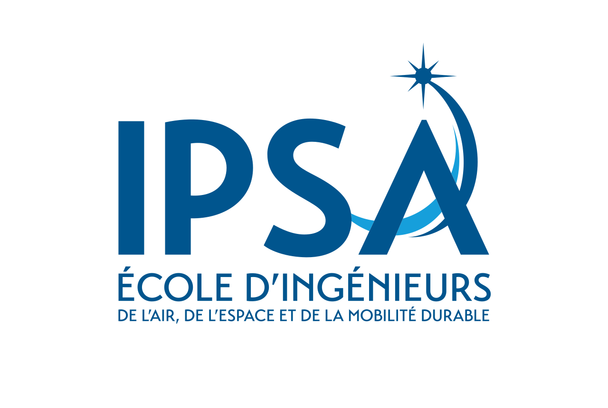

   
  
   

<h1 align="center">CI422-Satellite images and machine learning</h1>

  Projet réalisé par : Charbel GHANEM / Yaasine MOSAFER / Arthur TOUATI
   
  License : MIT
   
  Version : 1.0
   

---

## Description du Projet

[Décrivez ici en détail ce que fait votre projet. Par exemple : Les objectifs, les fonctionnalités principales, les technologies utilisées, etc.]

## Installation

[Expliquez ici comment installer les dépendances et configurer l'environnement pour exécuter votre projet.]

